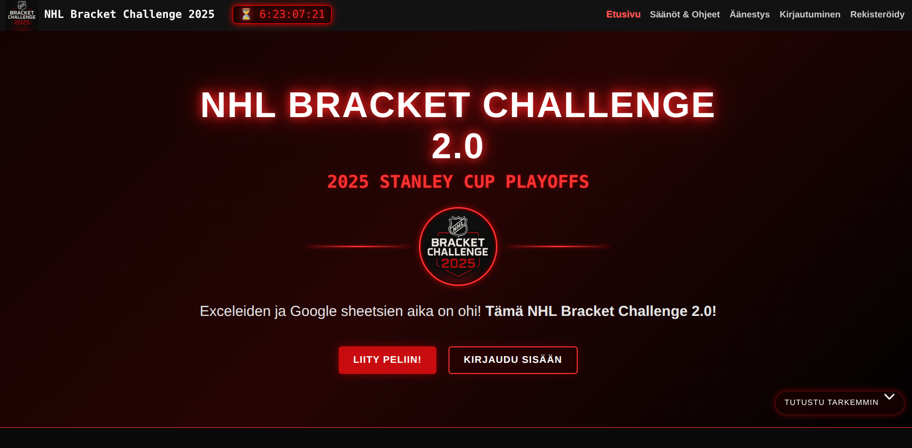
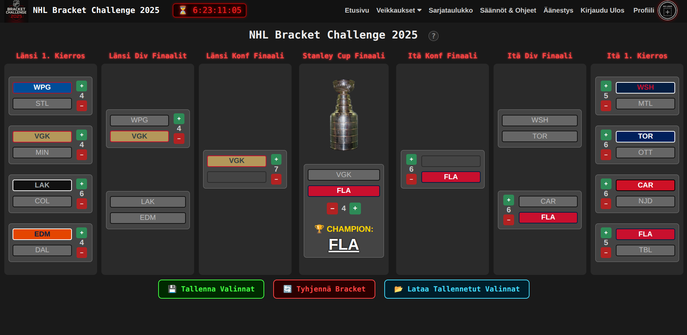
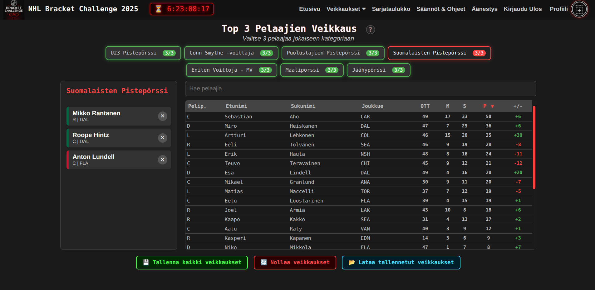

# NHL Bracket Challenge 2.0

A full-stack web application for NHL playoff bracket predictions, built for the 2025 Stanley Cup Playoffs. Users compete by predicting playoff matchup winners and forecasting statistical category leaders.

**[Live Demo](https://bracket-challenge2-0.vercel.app)** | **Demo Registration Code: `PORTFOLIO2026`**

> ⏳ **Note:** This full-stack app runs entirely on free-tier services (Vercel + Render + Neon). The backend may take **30-60 seconds** to wake up on first request due to Render's cold start. After the initial load, everything runs smoothly. I chose Render because it offers the best free tier I could find for hosting Python backends.


---

## Table of Contents

- [Screenshots](#screenshots)
- [Project Overview](#project-overview)
- [Tech Stack](#tech-stack)
- [Development Notes](#development-notes)
- [Project Structure](#project-structure)
- [Game Modes](#game-modes)
- [Local Development](#local-development)
- [Deployment](#deployment)
- [Database Schema](#database-schema)
- [Future Improvements](#future-improvements)
- [Notes](#notes)
- [License](#license)

---

## Screenshots
**Homepage**

**Bracket View**

**Category Predictions**



> *The app is currently in [demo mode](https://bracket-challenge2-0.vercel.app). Register using code `PORTFOLIO2026` to explore all features*

---

## Project Overview

This project was developed as a passion project to replace the spreadsheet-based playoff prediction pools I've ran for past 5 years. The app was used by **~20 players** during the 2025 NHL Playoffs, handling real-time scoring updates and leaderboard tracking throughout the postseason.

### Key Features

- **Bracket Predictions** - Pick winners and series lengths for all 4 rounds of the playoffs
- **Top 3 Predictions** - Forecast leaders in 7 statistical categories (goals, penalty minutes, defense points, U23 points, goalie wins, Finnish player points, Conn Smythe winner)
- **User Dashboards** - Personal stats with comparison to league averages
- **Leaderboard** - Live standings with point breakdowns
- **Prize Share Voting** - Users can vote on how to split the prize pool at the end of the season
- **Admin Panel** - Manage matchups, enter results, generate registration codes
- **Auth System** - Registration codes, secure login, team-logo management

### Technical Highlights

- **Real NHL Data** - Player/goalie stats pulled from the official NHL API (`api-web.nhle.com`)
- **Responsive Design** - Mobile-first approach with adaptive bracket visualization
- **RESTful API** - 40+ endpoints handling all game logic and user interactions
- **Deadline System** - Configurable submission cutoffs with grace periods

---

## Tech Stack

### Frontend
- **Angular 19** - Standalone components, signals, modern Angular patterns
- **TypeScript 5.6** - Strict typing throughout
- **CSS3** - Custom styling with team color theming
- **Vercel** - Deployment and hosting

### Backend
- **Flask 3.0** - Python web framework
- **Flask-SQLAlchemy** - ORM for database operations
- **Flask-Migrate** - Database migrations
- **Flask-CORS** - Cross-origin resource sharing
- **Gunicorn** - WSGI HTTP server
- **Render** - Backend hosting

### Database
- **PostgreSQL** (Neon) - Production database
- **SQLite** - Local development fallback

### External APIs
- **NHL API** - Player statistics and team data

---

## Development Notes

This project was intentionally used as an experiment in AI-assisted development. 
The frontend was largely built with AI pair-programming (GitHub Copilot), while I 
focused on architectural decisions, integration, debugging, and the backend data layer. 
This workflow allowed me to ship a production-ready app for ~20 users while learning 
Angular in the process. The experience reinforced that AI is a powerful productivity 
multiplier, but still requires strong fundamentals to direct effectively.

## Project Structure

```
BracketChallenge2.0/
├── backend/
│   ├── app.py              # Main Flask application (40+ API endpoints)
│   ├── models.py           # SQLAlchemy models (15+ tables)
│   ├── config.py           # Database configuration
│   ├── score_module.py     # Bracket scoring logic
│   ├── stats_module.py     # Statistical category tracking
│   └── nhl_api/            # NHL data population scripts
│       ├── populate_table.py
│       ├── populate_game_logs.py
│       └── daily_update.py
│
├── frontend/
│   └── src/
│       └── app/
│           ├── bracket/        # Playoff bracket component
│           ├── predictions/    # Top 3 predictions component
│           ├── user-dashboard/ # Personal stats dashboard
│           ├── user-view/      # Public user profile view
│           ├── leaderboard/    # Standings component
│           ├── admin/          # Admin panel
│           ├── services/       # API services
│           └── models/         # TypeScript interfaces
│
└── README.md
```

---

## Game Modes

### 1. Bracket Challenge
Predict the winner and number of games for each playoff series. Points are awarded based on:
- Correct winner picks
- Exact series length predictions
- Bonus points for later rounds (Conference Finals, Stanley Cup Final)

### 2. Top 3 Predictions
Select your predicted top 3 players in each category:
- **Goals** - Playoff goal leaders
- **Penalty Minutes** - Most penalized players
- **Defense Points** - Top-scoring defensemen
- **U23 Points** - Best young players (under 23)
- **Goalie Wins** - Winningest goalies
- **Finnish Points** - Top Finnish players
- **Conn Smythe** - Playoff MVP prediction

Points are calculated at the end of each round based on actual statistical leaders.

---

## Local Development

### Prerequisites
- Node.js 18+
- Python 3.11+
- PostgreSQL (or use SQLite for local dev)

### Backend Setup
```bash
cd backend
python -m venv venv
source venv/bin/activate  # Windows: venv\Scripts\activate
pip install -r requirements.txt

# Set environment variables (or create .env file)
export DATABASE_URL="sqlite:///local.db"  # or PostgreSQL URL
export FLASK_ENV=development

# Initialize database
flask db upgrade
python nhl_api/populate_table.py

# Run server
flask run
```

### Frontend Setup
```bash
cd frontend
npm install
ng serve
```

The app will be available at `http://localhost:4200`

---

## Deployment

### Backend (Render)
- Root Directory: `backend/`
- Build Command: `pip install -r requirements.txt`
- Start Command: `gunicorn app:app`
- Environment: `DATABASE_URL` pointing to Neon PostgreSQL

### Frontend (Vercel)
- Framework: Angular
- Build Command: `npm run build`
- Output Directory: `dist/frontend/browser`

---

## Database Schema

Key models include:
- `User` - Authentication and profile data
- `Pick` - Bracket predictions (JSON)
- `Prediction` - Top 3 category picks (JSON)
- `Matchup` / `MatchupResult` - Playoff series data
- `Player` / `Goalie` - NHL player statistics
- `UserPoints` - Scoring breakdown per game type and round
- `Team` - NHL team information

---

## Future Improvements

- [ ] Add lineup game view to dashboard (currently hidden)
- [ ] Implement real-time WebSocket updates for live scores
- [ ] Social features (comments, head-to-head comparisons)

---

## Notes

- **Demo Mode**: The app is currently in a demo state simulating the start of the 2025 playoffs
- **Finnish UI**: Primary language is Finnish as this was built for a Finnish user group
- **Production Use**: Successfully used by ~20 players during the actual 2025 NHL Playoffs

---

## License

This project is for portfolio demonstration purposes. NHL team logos and player data are property of the National Hockey League.
